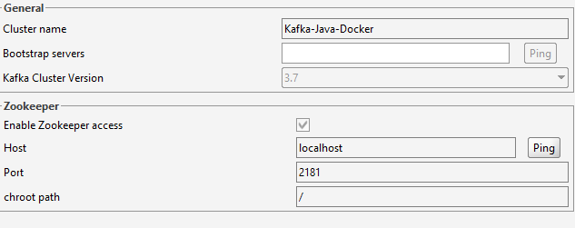
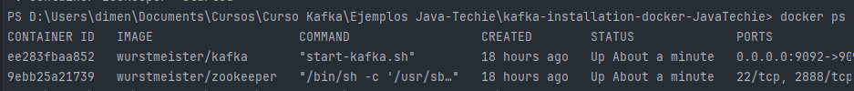

# kafka-installation

# Command uses 

### Run Kafka containe
```docker compose -f <fileName.yml> up -d```
### Move into Kafka container
```docker exec -it <kafka_conatiner_id> /bin/sh```
### Go inside kafka installation folder
```cd /opt/kafka_<version>/bin```
### Create Kafka topic
```kafka-topics.sh --create --zookeeper zookeeper:2181 --replication-factor 1 --partitions 1 --topic <Name_topic>```
### Start Producer app (CLI)
```kafka-console-producer.sh --topic <Name_topic> --bootstrap-server localhost:9092```
### Start consumer app (CLI)
```kafka-console-consumer.sh --topic <Name_topic> --from-beginning --bootstrap-server localhost:9092```
### Conect Offset Explorer


### Detener Docker
``` 1.- Ver los contenedores en ejecución: docker ps```<br>

``` 2.- Detener Kafka: docker stop <contendore_id>```<br>
``` 3.- Detener zookerper: docker stop <contendore_id>```<br>

